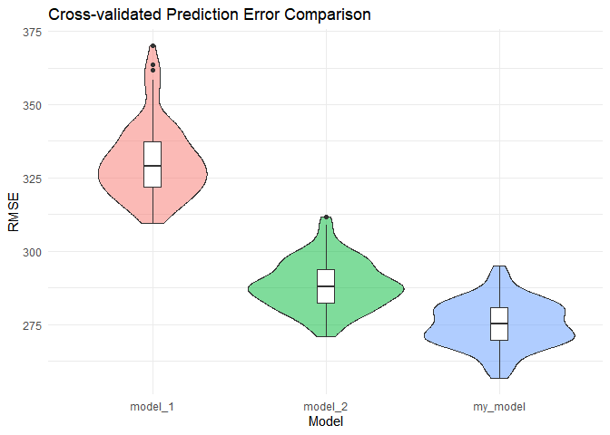
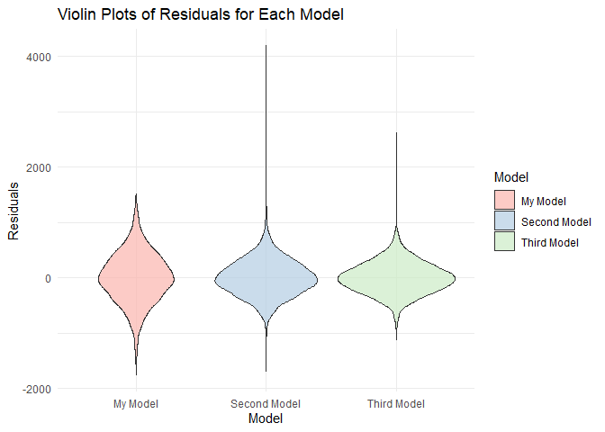
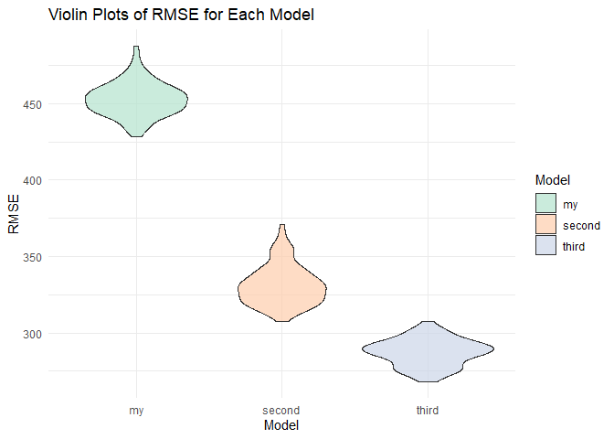

p8105_hw6_yh3683
================
Yining He
2024-11-21

# Problem1

``` r
weather_df <- rnoaa::meteo_pull_monitors(
  c("USW00094728"),
  var = c("PRCP", "TMIN", "TMAX"),
  date_min = "2017-01-01",
  date_max = "2017-12-31"
) %>%
  mutate(
    name = recode(id, USW00094728 = "CentralPark_NY"),
    tmin = tmin / 10,
    tmax = tmax / 10
  ) %>%
  select(name, id, everything())
```

    ## using cached file: C:\Users\heyining\AppData\Local/R/cache/R/rnoaa/noaa_ghcnd/USW00094728.dly

    ## date created (size, mb): 2024-09-03 10:44:01.93335 (8.653)

    ## file min/max dates: 1869-01-01 / 2024-09-30

``` r
view(weather_df)
```

``` r
set.seed(123)

# Generate 5000 bootstrap samples and compute statistics
bootstrap_results = tibble(strap_number = 1:5000) %>%
  mutate(
  
    strap_sample = map(strap_number, ~sample_n(weather_df, size = nrow(weather_df), replace = TRUE)),
    
    models = map(strap_sample, ~lm(tmax ~ tmin, data = .x)),
    
    r_squared = map_dbl(models, ~glance(.x)$r.squared),
    
    # Extract coefficients and compute log(β0*β1)
    log_betas = map_dbl(models, ~{
      coefs = tidy(.x)$estimate
      log(coefs[1] * coefs[2])
    })
  )
```

``` r
# Distribution of R-squared
p1 = ggplot(bootstrap_results, aes(x = r_squared)) +
  geom_density(fill = "lightblue", alpha = 0.5) +
  labs(
    title = "Bootstrap Distribution of R-squared",
    x = "R-squared",
    y = "Density"
  ) +
  theme_minimal()

# Distribution of log(β0*β1)
p2 = ggplot(bootstrap_results, aes(x = log_betas)) +
  geom_density(fill = "lightgreen", alpha = 0.5) +
  labs(
    title = "Bootstrap Distribution of log(β0*β1)",
    x = "log(β0*β1)",
    y = "Density"
  ) +
  theme_minimal()

library(patchwork)
p1 + p2
```

<!-- -->

    ## 
    ## 95% Confidence Interval for R-squared: 
    ## Lower bound: 0.8946 
    ## Upper bound: 0.9271

The bootstrap analysis with 5000 samples of the 2017 Central Park
weather data shows R-squared values ranging from 0.89 to 0.93 (95% CI),
with a symmetrical distribution centered around 0.91. This indicates
that minimum temperature explains approximately 90% of the variation in
maximum temperature.

    ## 
    ## 
    ## 95% Confidence Interval for log(β0*β1): 
    ## Lower bound: 1.9642 
    ## Upper bound: 2.0584

The log(β0\*β1) estimates display a normal distribution centered around
2.0, with a 95% confidence interval of \[1.96, 2.06\]. This entirely
positive and narrow interval confirms a significant and stable positive
relationship between minimum and maximum temperatures.

# Problem 2

``` r
homicide_data <- read.csv("homicide-data.csv", stringsAsFactors = FALSE, encoding = "latin1")

homicide_data <- homicide_data %>%
  mutate(city_state = paste(city, state, sep = ", "))

homicide_data <- homicide_data %>%
  mutate(solved = ifelse(grepl("Closed by arrest", disposition), 1, 0))

excluded_cities <- c("Dallas, TX", "Phoenix, AZ", "Kansas City, MO", "Tulsa, AL")
homicide_data <- homicide_data %>%
  filter(!city_state %in% excluded_cities)

homicide_data <- homicide_data %>%
  filter(victim_race %in% c("White", "Black"))

homicide_data <- homicide_data %>%
  mutate(victim_age = as.numeric(victim_age)) %>%
  drop_na(victim_age, victim_sex, victim_race, solved)

view(homicide_data)
```

``` r
baltimore_data <- homicide_data %>%
  filter(city_state == "Baltimore, MD")

baltimore_model <- glm(solved ~ victim_age + victim_sex + victim_race,
                       family = binomial(link = "logit"),
                       data = baltimore_data)

baltimore_results <- broom::tidy(baltimore_model, exponentiate = TRUE, conf.int = TRUE)


baltimore_sex_or <- baltimore_results %>%
  filter(term == "victim_sexMale")


baltimore_results_filtered <- baltimore_sex_or %>%
  select(estimate, conf.low, conf.high)

knitr::kable(baltimore_results_filtered, 
             col.names = c("Estimate", "Lower CI", "Upper CI")) 
```

|  Estimate |  Lower CI |  Upper CI |
|----------:|----------:|----------:|
| 0.4255117 | 0.3241908 | 0.5575508 |

The odds ratio for solving homicides involving male victims in Baltimore
is 0.4255, with a confidence interval of 0.3242 to 0.5575 which does not
include 1. This implies that the observed effect is statistically
significant at the 95% confidence level.

``` r
city_results <- homicide_data %>%
  group_by(city_state) %>%
  nest() %>%
  mutate(model = map(data, ~ glm(solved ~ victim_age + victim_sex + victim_race,
                                 family = binomial(link = "logit"),
                                 data = .x)),
         results = map(model, ~ tidy(.x, exponentiate = TRUE, conf.int = TRUE))) %>%
  unnest(results) %>%
  filter(term == "victim_sexMale") %>%
  select(city_state, estimate, conf.low, conf.high)

city_results <- city_results %>%
  rename(Odds_Ratio = estimate, CI_Lower = conf.low, CI_Upper = conf.high)

print(city_results)
```

    ## # A tibble: 47 × 4
    ## # Groups:   city_state [47]
    ##    city_state      Odds_Ratio CI_Lower CI_Upper
    ##    <chr>                <dbl>    <dbl>    <dbl>
    ##  1 Albuquerque, NM      1.77     0.825    3.76 
    ##  2 Atlanta, GA          1.00     0.680    1.46 
    ##  3 Baltimore, MD        0.426    0.324    0.558
    ##  4 Baton Rouge, LA      0.381    0.204    0.684
    ##  5 Birmingham, AL       0.870    0.571    1.31 
    ##  6 Boston, MA           0.674    0.353    1.28 
    ##  7 Buffalo, NY          0.521    0.288    0.936
    ##  8 Charlotte, NC        0.884    0.551    1.39 
    ##  9 Chicago, IL          0.410    0.336    0.501
    ## 10 Cincinnati, OH       0.400    0.231    0.667
    ## # ℹ 37 more rows

``` r
ggplot(city_results, aes(x = reorder(city_state, Odds_Ratio), y = Odds_Ratio)) +
  geom_point() +
  geom_errorbar(aes(ymin = CI_Lower, ymax = CI_Upper), width = 0.2) +
  geom_hline(yintercept = 1, linetype = "dashed", color = "red") +
  coord_flip() +
  scale_y_log10() +
  labs(title = "Adjusted Odds Ratios for Solving Homicides ",
       x = "City", y = "Adjusted Odds Ratio (Log Scale)") +
  theme_minimal()
```

<!-- -->

The plot shows that homicides involving male victims are less likely to
be solved (OR \< 1) in most U.S. cities. Significant disparities are
seen in cities like New York, NY, Cincinnati, OH, and Baltimore, MD,
where confidence intervals are entirely below 1. Variability across
cities highlights differences in solving homicides, with male victim
cases consistently showing lower resolution rates.

# Probelm 3

Cleaned the data by checking for missing values and converting necessary
variables into appropriate types

``` r
birthweight <- read.csv("birthweight.csv") %>%
  janitor::clean_names() %>%
  mutate(
    babysex = factor(babysex, levels = c(1, 2), labels = c("Male", "Female")),
    frace = factor(frace, levels = c(1, 2, 3, 4, 8, 9), 
                   labels = c("White", "Black", "Asian", "Puerto Rican", "Other", "Unknown")),
    mrace = factor(mrace, levels = c(1, 2, 3, 4, 8), 
                   labels = c("White", "Black", "Asian", "Puerto Rican", "Other")),
    malform = factor(malform, levels = c(0, 1), labels = c("Absent", "Present"))
  )

# Check for missing values
sum(is.na(birthweight))
```

    ## [1] 0

Defined the formula bwt ~ wtgain + gaweeks + smoken based on
hypothesized relationships

``` r
my_model <- lm(bwt ~ wtgain + gaweeks + smoken, data = birthweight)
summary(my_model)
```

    ## 
    ## Call:
    ## lm(formula = bwt ~ wtgain + gaweeks + smoken, data = birthweight)
    ## 
    ## Residuals:
    ##      Min       1Q   Median       3Q      Max 
    ## -1761.41  -290.52    -1.11   294.63  1507.60 
    ## 
    ## Coefficients:
    ##             Estimate Std. Error t value Pr(>|t|)    
    ## (Intercept) 464.8353    86.4306   5.378 7.92e-08 ***
    ## wtgain        9.0068     0.6370  14.141  < 2e-16 ***
    ## gaweeks      62.8482     2.2105  28.432  < 2e-16 ***
    ## smoken       -6.5582     0.9313  -7.042 2.19e-12 ***
    ## ---
    ## Signif. codes:  0 '***' 0.001 '**' 0.01 '*' 0.05 '.' 0.1 ' ' 1
    ## 
    ## Residual standard error: 454.1 on 4338 degrees of freedom
    ## Multiple R-squared:  0.2143, Adjusted R-squared:  0.2138 
    ## F-statistic: 394.4 on 3 and 4338 DF,  p-value: < 2.2e-16

``` r
birthweight <- birthweight %>%
  add_predictions(my_model) %>%
  add_residuals(my_model)

ggplot(birthweight, aes(x = pred, y = resid)) +
  geom_point(alpha = 0.5) +
  geom_hline(yintercept = 0, color = "red", linetype = "dashed") +
  labs(
    title = "Residuals vs Fitted Values for My Model",
    x = "Fitted Values",
    y = "Residuals"
  ) +
  theme_minimal()
```

<!-- -->

This plot indicates no clear patterns, suggesting that the linear
regression model fits the data reasonably well. While there are some
outliers, the residuals are generally centered and exhibit
homoscedasticity (constant variance).

Compare my model to two others:

``` r
my_model <- lm(bwt ~ wtgain + gaweeks + smoken, data = birthweight)
second_model <- lm(bwt ~ blength + gaweeks, data = birthweight)
third_model <- lm(bwt ~ bhead * blength * babysex, data = birthweight)

residuals_my <- residuals(my_model)
residuals_second <- residuals(second_model)
residuals_third <- residuals(third_model)


residuals_data <- bind_rows(
  data.frame(Model = "My Model", Residuals = residuals_my),
  data.frame(Model = "Second Model", Residuals = residuals_second),
  data.frame(Model = "Third Model", Residuals = residuals_third)
)

ggplot(residuals_data, aes(x = Model, y = Residuals, fill = Model)) +
  geom_violin(alpha = 0.7) +
  labs(
    title = "Violin Plots of Residuals for Each Model",
    x = "Model",
    y = "Residuals"
  ) +
  theme_minimal() +
  scale_fill_brewer(palette = "Pastel1")
```

<!-- -->

The Plot shows residuals centered around 0 for all models, indicating
unbiased predictions. The Third Model has wider tails, suggesting larger
deviations, while My Model and the Second Model have tighter
distributions, indicating better performance.

``` r
set.seed(42)
cv_split <- crossv_mc(birthweight, 100) %>%
  mutate(
    train = map(train, as_tibble),
    test  = map(test, as_tibble)
  )


cv_results <- cv_split %>%
  mutate(
    rmse_my = map2_dbl(train, test, ~ sqrt(mean((predict(my_model, newdata = .y) - .y$bwt)^2))),
    rmse_second = map2_dbl(train, test, ~ sqrt(mean((predict(second_model, newdata = .y) - .y$bwt)^2))),
    rmse_third = map2_dbl(train, test, ~ sqrt(mean((predict(third_model, newdata = .y) - .y$bwt)^2)))
  ) %>%
  pivot_longer(cols = starts_with("rmse"), names_to = "Model", values_to = "RMSE") %>%
  mutate(Model = str_replace(Model, "rmse_", "")) 

# Plot RMSE violin plots
ggplot(cv_results, aes(x = Model, y = RMSE, fill = Model)) +
  geom_violin(alpha = 0.7) +
  labs(
    title = "Violin Plots of RMSE for Each Model",
    x = "Model",
    y = "RMSE"
  ) +
  theme_minimal() +
  scale_fill_brewer(palette = "Pastel2")
```

<!-- -->

The Second Model (using blength and gaweeks) makes it the most accurate
predictor of birthweight. My Model performs moderately with a slightly
higher RMSE, while the Third Model has poorer performance likely due to
overfitting caused by the inclusion of complex interactions.
