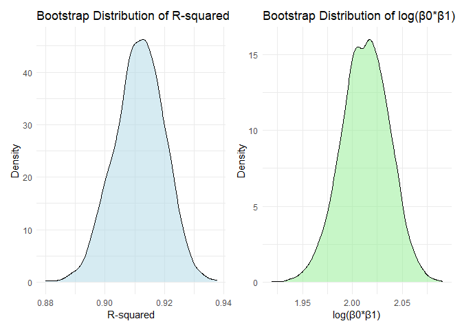
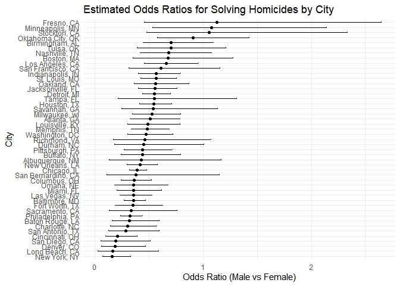

p8105_hw6_yh3683
================
Yining He
2024-11-21

# Problem1

    ## using cached file: C:\Users\heyining\AppData\Local/R/cache/R/rnoaa/noaa_ghcnd/USW00094728.dly

    ## date created (size, mb): 2024-09-03 10:44:01.93335 (8.653)

    ## file min/max dates: 1869-01-01 / 2024-09-30

<!-- -->

    ## 
    ## 95% Confidence Interval for R-squared: 
    ## Lower bound: 0.8946 
    ## Upper bound: 0.9271

The bootstrap analysis with 5000 samples of the 2017 Central Park
weather data shows R-squared values ranging from 0.89 to 0.93 (95% CI),
with a symmetrical distribution centered around 0.91. This indicates
that minimum temperature explains approximately 90% of the variation in
maximum temperature.

    ## 
    ## 
    ## 95% Confidence Interval for log(β0*β1): 
    ## Lower bound: 1.9642 
    ## Upper bound: 2.0584

The log(β0\*β1) estimates display a normal distribution centered around
2.0, with a 95% confidence interval of \[1.96, 2.06\]. This entirely
positive and narrow interval confirms a significant and stable positive
relationship between minimum and maximum temperatures.

# Problem 2

    ## Warning: There was 1 warning in `mutate()`.
    ## ℹ In argument: `victim_age = as.numeric(victim_age)`.
    ## Caused by warning:
    ## ! NAs introduced by coercion

    ## # A tibble: 1 × 3
    ##   estimate conf.low conf.high
    ##      <dbl>    <dbl>     <dbl>
    ## 1    0.355    0.267     0.468

The odds ratio for solving homicides involving male victims in Baltimore
is 0.3547, with a confidence interval of 0.2672 to 0.4679. This
indicates significantly lower odds of solving male victim cases compared
to female victims.

    ## Warning: There were 44 warnings in `mutate()`.
    ## The first warning was:
    ## ℹ In argument: `model_results = map(data, fit_glm)`.
    ## ℹ In group 1: `city_state = "Albuquerque, NM"`.
    ## Caused by warning:
    ## ! glm.fit: fitted probabilities numerically 0 or 1 occurred
    ## ℹ Run `dplyr::last_dplyr_warnings()` to see the 43 remaining warnings.

<!-- -->

The plot shows the estimated odds ratios for solving homicides involving
male victims compared to female victims across various U.S. cities.
There is notable variation, with some cities (e.g., Fresno, CA, and
Minneapolis, MN) showing higher odds of solving male homicides, while
others (e.g., New York, NY) show higher odds for female homicides.
