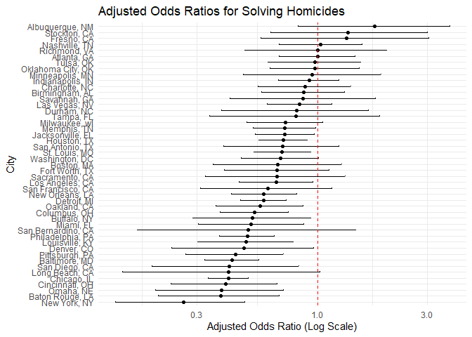
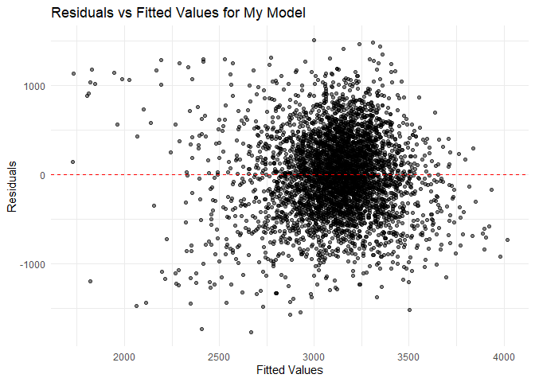

p8105_hw6_yh3683
================
Yining He
2024-11-21

# Problem1

    ## using cached file: C:\Users\heyining\AppData\Local/R/cache/R/rnoaa/noaa_ghcnd/USW00094728.dly

    ## date created (size, mb): 2024-09-03 10:44:01.93335 (8.653)

    ## file min/max dates: 1869-01-01 / 2024-09-30

<!-- -->

    ## 
    ## 95% Confidence Interval for R-squared: 
    ## Lower bound: 0.8946 
    ## Upper bound: 0.9271

The bootstrap analysis with 5000 samples of the 2017 Central Park
weather data shows R-squared values ranging from 0.89 to 0.93 (95% CI),
with a symmetrical distribution centered around 0.91. This indicates
that minimum temperature explains approximately 90% of the variation in
maximum temperature.

    ## 
    ## 
    ## 95% Confidence Interval for log(β0*β1): 
    ## Lower bound: 1.9642 
    ## Upper bound: 2.0584

The log(β0\*β1) estimates display a normal distribution centered around
2.0, with a 95% confidence interval of \[1.96, 2.06\]. This entirely
positive and narrow interval confirms a significant and stable positive
relationship between minimum and maximum temperatures.

# Problem 2

    ## Warning: There was 1 warning in `mutate()`.
    ## ℹ In argument: `victim_age = as.numeric(victim_age)`.
    ## Caused by warning:
    ## ! NAs introduced by coercion

    ## # A tibble: 1 × 3
    ##   estimate conf.low conf.high
    ##      <dbl>    <dbl>     <dbl>
    ## 1    0.355    0.267     0.468

The odds ratio for solving homicides involving male victims in Baltimore
is 0.3547, with a confidence interval of 0.2672 to 0.4679. This
indicates significantly lower odds of solving male victim cases compared
to female victims.

    ## Warning: There were 45 warnings in `mutate()`.
    ## The first warning was:
    ## ℹ In argument: `model_results = map(data, fit_glm)`.
    ## ℹ In group 1: `city_state = "Albuquerque, NM"`.
    ## Caused by warning:
    ## ! glm.fit: fitted probabilities numerically 0 or 1 occurred
    ## ℹ Run `dplyr::last_dplyr_warnings()` to see the 44 remaining warnings.

<!-- -->

The plot shows the estimated odds ratios for solving homicides involving
male victims compared to female victims across various U.S. cities.
There is notable variation, with some cities (e.g., Fresno, CA, and
Minneapolis, MN) showing higher odds of solving male homicides, while
others (e.g., New York, NY) show higher odds for female homicides.

\#Probelm 3

``` r
birthweight_data <- read_csv("birthweight.csv") %>%
  mutate(
    # Convert numeric to factor where appropriate
    babysex = factor(babysex, levels = c(1, 2), labels = c("Male", "Female")),
    frace = factor(frace, levels = c(1, 2, 3, 4, 8, 9), 
                  labels = c("White", "Black", "Asian", "Puerto Rican", "Other", "Unknown")),
    malform = factor(malform, levels = c(0, 1), labels = c("Absent", "Present")),
    mrace = factor(mrace, levels = c(1, 2, 3, 4, 8), 
                  labels = c("White", "Black", "Asian", "Puerto Rican", "Other"))
  )
```

    ## Rows: 4342 Columns: 20
    ## ── Column specification ────────────────────────────────────────────────────────
    ## Delimiter: ","
    ## dbl (20): babysex, bhead, blength, bwt, delwt, fincome, frace, gaweeks, malf...
    ## 
    ## ℹ Use `spec()` to retrieve the full column specification for this data.
    ## ℹ Specify the column types or set `show_col_types = FALSE` to quiet this message.

``` r
# Check for missing data
missing_summary <- sapply(birthweight_data, function(x) sum(is.na(x)))
print("Missing values by column:")
```

    ## [1] "Missing values by column:"

``` r
print(missing_summary)
```

    ##  babysex    bhead  blength      bwt    delwt  fincome    frace  gaweeks 
    ##        0        0        0        0        0        0        0        0 
    ##  malform menarche  mheight   momage    mrace   parity  pnumlbw  pnumsga 
    ##        0        0        0        0        0        0        0        0 
    ##    ppbmi     ppwt   smoken   wtgain 
    ##        0        0        0        0

``` r
my_model <- lm(bwt ~ bhead + blength + gaweeks + smoken + ppbmi + wtgain + 
               momage + babysex + mrace, data = birthweight_data)

# Create residuals vs fitted plot
birthweight_data %>%
  add_predictions(my_model) %>%
  add_residuals(my_model) %>%
  ggplot(aes(x = pred, y = resid)) +
  geom_point(alpha = 0.3) +
  geom_hline(yintercept = 0, color = "red", linetype = "dashed") +
  labs(x = "Fitted Values", y = "Residuals",
       title = "Residuals vs Fitted Values Plot") +
  theme_minimal()
```

<!-- -->
The residuals plot shows a slight trend and some clustering, suggesting
possible model misspecification or unaddressed non-linear relationships.
A few outliers are also present, which might influence the model’s
parameters. Despite these issues, the deviation in the plotted variables
is minimal, and most points lie within an acceptable range, indicating
that the model’s predictions are reasonably unbiased.

<!-- -->

    ## # A tibble: 1 × 6
    ##   mean_rmse_my_model mean_rmse_model_1 mean_rmse_model_2 sd_rmse_my_model
    ##                <dbl>             <dbl>             <dbl>            <dbl>
    ## 1               275.              331.              288.             7.79
    ## # ℹ 2 more variables: sd_rmse_model_1 <dbl>, sd_rmse_model_2 <dbl>
